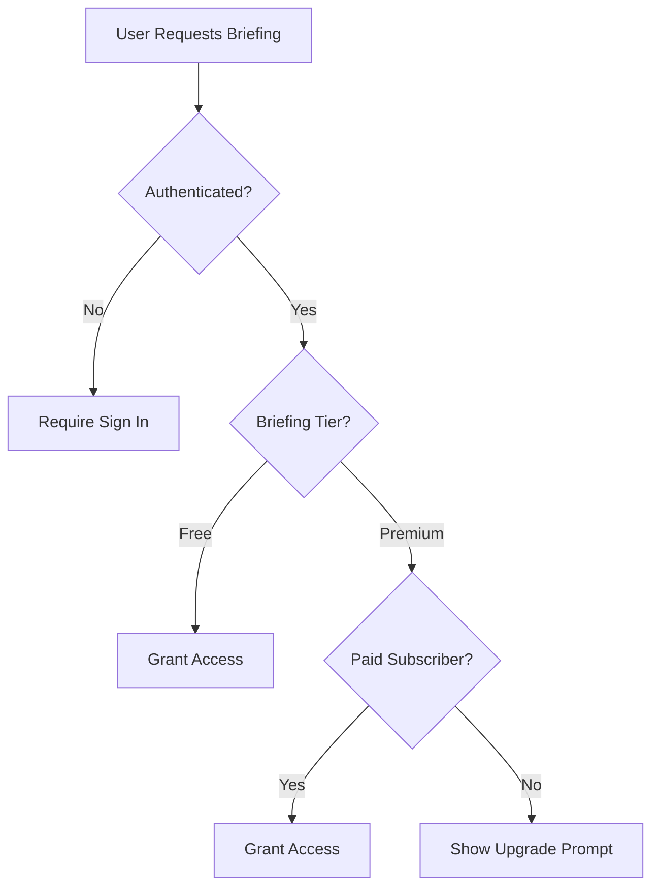

# MarketMotion - Tiered Briefing System

## Overview

MarketMotion now offers two tiers of daily market briefings:

1. **Free Tier**: 3-minute condensed briefings for all registered users
2. **Premium Tier**: Full 5-minute comprehensive briefings for paid subscribers

## Tier Comparison

| Feature | Free Tier | Premium Tier |
|---------|-----------|--------------|
| **Duration** | 3 minutes | 5 minutes |
| **Word Count** | ~450 words | ~800 words |
| **Content** | Key highlights only | Comprehensive analysis |
| **Sections** | 5 sections | 7+ sections |
| **Market Overview** | Basic | Detailed |
| **Stock Coverage** | Top 3 movers | Extensive coverage |
| **Economic Data** | Brief summary | In-depth analysis |
| **Tech Updates** | Quick mention | Full sector analysis |
| **International** | Not included | Full coverage |
| **Commodities** | Not included | Complete analysis |
| **Access** | All registered users | Paid subscribers only |
| **Update Frequency** | Daily | Daily (morning, afternoon, evening) |

## Free Tier Content (3 minutes)

Free briefings include:
- Brief market overview (major indices)
- Top 3 stock movers
- Key economic news
- Quick tech update
- Upgrade prompt at the end

## Premium Tier Content (5 minutes)

Premium briefings include everything in free tier plus:
- Detailed market analysis with volume and sentiment
- Comprehensive stock coverage (10+ companies)
- In-depth economic indicators and Fed policy
- Full technology sector developments
- Energy and commodities market analysis
- International markets overview
- Market outlook and predictions

## File Generation

### Scripts

1. **Generate Free Briefing Only**:
   ```bash
   ./generate_free_briefing.py
   ```
   Creates 3-minute briefing for free users

2. **Generate Premium Briefing Only**:
   ```bash
   ./generate_briefing_supabase.py
   ```
   Creates 5-minute briefing for premium users

3. **Generate Both Tiers** (Recommended):
   ```bash
   ./generate_all_briefings.py
   ```
   Creates both free and premium briefings in one run

## Database Setup

### 1. Initial Setup
Run `setup_supabase.sql` in your Supabase SQL editor to create:
- `user_profiles` table
- `briefings` table
- Basic RLS policies

### 2. Free Tier Update
Run `update_supabase_free_tier.sql` to add:
- Tier column to briefings
- Free tier access policies
- Helper functions for access control
- Views for easy querying

## Storage Structure

Briefings are stored in Supabase with this structure:
```
briefings/
├── YYYY/
│   ├── MM/
│   │   ├── DD/
│   │   │   ├── free_morning/
│   │   │   │   └── free_morning_TIMESTAMP.mp3
│   │   │   ├── free_afternoon/
│   │   │   │   └── free_afternoon_TIMESTAMP.mp3
│   │   │   ├── free_evening/
│   │   │   │   └── free_evening_TIMESTAMP.mp3
│   │   │   ├── morning/
│   │   │   │   └── briefing_morning_TIMESTAMP.mp3
│   │   │   ├── afternoon/
│   │   │   │   └── briefing_afternoon_TIMESTAMP.mp3
│   │   │   └── evening/
│   │   │       └── briefing_evening_TIMESTAMP.mp3
```

## Access Control

### Row Level Security (RLS) Policies

1. **Free Briefings**: 
   - Accessible to all authenticated users
   - Requires user to be logged in
   - 30-minute signed URL expiry

2. **Premium Briefings**:
   - Accessible only to paid subscribers
   - Checks `is_paid_subscriber` status
   - Validates `subscription_expires_at` date
   - 1-hour signed URL expiry

### User Access Flow



## API Integration

### Get User's Accessible Briefings
```python
# Using the Supabase service
supabase = get_supabase_service()

# Check user access
access = await supabase.check_user_access(user_id)
if access["has_access"]:
    # User is premium subscriber
    briefings = await supabase.list_briefings(tier="premium")
else:
    # User is free tier
    briefings = await supabase.list_briefings(tier="free")
```

### Get Briefing with Access Check
```python
# Get briefing URL (automatically checks access)
result = await supabase.get_briefing_url(
    briefing_id="...",
    user_id="..."
)

if result["success"]:
    audio_url = result["url"]
    tier = result["tier"]
else:
    error = result["error"]
    # If premium required, show upgrade prompt
```

## Metadata Structure

Each briefing includes metadata:
```json
{
    "generated_at": "2024-08-11T10:30:00Z",
    "time_of_day": "morning",
    "day_of_week": "Sunday",
    "article_count": 30,
    "tier": "free",
    "version": "3-minute",
    "voice_model": "802e3bc2b27e49c2995d23ef70e6ac89",
    "sections": ["market_overview", "top_stocks", "economic", "tech", "closing"]
}
```

## Upgrade Prompts

Free briefings end with:
> "For complete market analysis including international markets, commodities, and detailed sector breakdowns, upgrade to our premium briefing service."

This encourages free users to upgrade for full content access.

## Testing

### Test Free User Access
```sql
-- Check what briefings a free user can see
SELECT * FROM public.free_briefings;

-- Check today's briefings
SELECT * FROM public.todays_briefings;
```

### Test Premium User Access
```sql
-- Check user's subscription status
SELECT * FROM public.user_profiles WHERE id = 'USER_ID';

-- Get accessible briefings for a user
SELECT * FROM public.get_user_briefings('USER_ID');
```

## Monitoring

Track usage with these queries:
```sql
-- Daily briefing generation stats
SELECT 
    briefing_date,
    tier,
    COUNT(*) as count,
    AVG(word_count) as avg_words,
    AVG(duration_seconds) as avg_duration
FROM public.briefings
GROUP BY briefing_date, tier
ORDER BY briefing_date DESC;

-- User tier distribution
SELECT 
    subscription_tier,
    COUNT(*) as user_count
FROM public.user_profiles
GROUP BY subscription_tier;
```

## Future Enhancements

- [ ] Personalized free briefings based on user interests
- [ ] Weekend market wrap-ups
- [ ] Breaking news alerts for premium users
- [ ] Podcast-style interviews (premium only)
- [ ] Custom briefing times
- [ ] Email delivery option
- [ ] Mobile push notifications

## Support

For issues or questions:
- Check logs in generated files
- Review Supabase dashboard for storage/database issues
- Ensure all API keys are properly set in `.env`