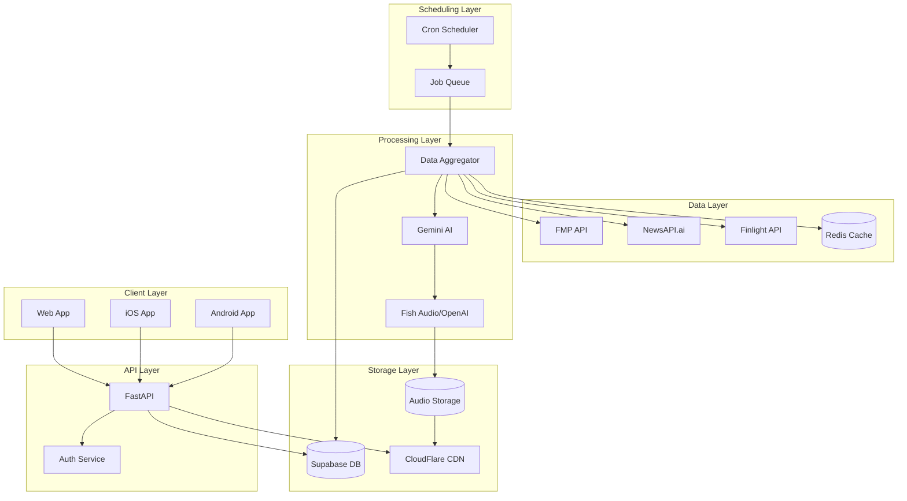

# Technical Architecture: Automated Briefings System

## System Architecture Overview



---

## Component Architecture

### 1. Scheduling Layer

#### Scheduler Service (`scheduler_service.py`)
```python
class SchedulerService:
    def __init__(self):
        self.scheduler = AsyncIOScheduler(
            timezone='America/New_York',
            job_defaults={
                'coalesce': True,
                'max_instances': 3,
                'misfire_grace_time': 300
            }
        )
        
    async def initialize(self):
        # Define 3 comprehensive 10-minute briefings
        briefing_schedule = [
            ('05:00', 'morning', 'Pre-market comprehensive analysis'),
            ('13:00', 'midday', 'Mid-trading comprehensive review'),
            ('19:00', 'evening', 'Full day comprehensive wrap')
        ]
        
        # Schedule all briefings
        for time_str, briefing_type, description in briefing_schedule:
            hour, minute = map(int, time_str.split(':'))
            self.scheduler.add_job(
                self.generate_comprehensive_briefing,
                'cron',
                hour=hour,
                minute=minute,
                id=f'{briefing_type}_briefing',
                args=[briefing_type, description]
            )
        
        # Sector briefings - daily at 7 AM
        self.scheduler.add_job(
            self.generate_sector_briefings,
            'cron',
            hour=7,
            minute=0,
            id='sector_briefings'
        )
        
    async def generate_comprehensive_briefing(self, briefing_type: str, description: str):
        # All general briefings are 10 minutes
        job = BriefingJob(
            type=briefing_type,
            description=description,
            duration_minutes=10,
            word_count_target=1600  # Target for 10 minutes
        )
        await self.job_queue.enqueue(job)
        
    async def generate_sector_briefings(self):
        sectors = ['XLK', 'XLV', 'XLF', 'XLE', 'XLY']
        for sector in sectors:
            job = BriefingJob(type='sector', sector_code=sector)
            await self.job_queue.enqueue(job)
```

#### Job Queue Architecture
```python
class JobQueue:
    def __init__(self):
        self.redis = aioredis.from_url("redis://localhost")
        self.workers = []
        
    async def enqueue(self, job: BriefingJob):
        # Simple queue for 3 daily briefings
        await self.redis.lpush('briefing_queue', job.serialize())
        
    async def process_jobs(self):
        while True:
            # Process briefing jobs sequentially
            job_data = await self.redis.brpop('briefing_queue', timeout=30)
            if not job_data:
                continue
                
            job = BriefingJob.deserialize(job_data[1])
            
            try:
                await self.execute_job(job)
            except Exception as e:
                logger.error(f"Job failed: {e}")
                await self.handle_failure(job)
                
    async def execute_job(self, job: BriefingJob):
        # Execute 10-minute comprehensive briefing
        logger.info(f"Generating {job.type} briefing: {job.description}")
        
        # Aggregate comprehensive data
        data = await self.aggregate_comprehensive_data(job.type)
        
        # Generate 1500-1700 word content
        content = await self.generate_content(data, job.word_count_target)
        
        # Generate 10-minute audio
        audio = await self.generate_audio(content)
        
        # Store and distribute
        await self.store_briefing(job, content, audio)
```

### 2. Data Aggregation Layer

#### Multi-Source Aggregator
```python
class DataAggregator:
    def __init__(self):
        self.fmp = FMPService()
        self.newsapi = NewsAPIAIService()
        self.finlight = NewsService()
        self.cache = RedisCache()
        
    async def aggregate_market_data(self, briefing_type: str):
        # Check cache first
        cache_key = f"market_data:{briefing_type}:{datetime.now().hour}"
        cached = await self.cache.get(cache_key)
        if cached:
            return cached
            
        # Parallel fetch from all sources
        tasks = [
            self.fmp.get_market_indices(),
            self.fmp.get_market_movers(),
            self.newsapi.fetch_financial_news(),
            self.finlight.fetch_general_news()
        ]
        
        results = await asyncio.gather(*tasks, return_exceptions=True)
        
        # Process and normalize data
        data = self.normalize_data(results)
        
        # Cache for 5 minutes
        await self.cache.set(cache_key, data, ttl=300)
        
        return data
```

#### Sector-Specific Aggregation
```python
class SectorAggregator:
    SECTOR_CONFIG = {
        'XLK': {
            'name': 'Technology',
            'keywords': ['tech', 'software', 'semiconductor', 'AI'],
            'top_holdings': ['AAPL', 'MSFT', 'NVDA', 'AVGO', 'ORCL'],
            'subsectors': ['software', 'hardware', 'semiconductors']
        },
        # ... other sectors
    }
    
    async def aggregate_sector_data(self, sector_code: str):
        config = self.SECTOR_CONFIG[sector_code]
        
        # Parallel fetch sector-specific data
        tasks = [
            self.fmp.get_sector_performance(sector_code),
            self.fmp.get_quote(config['top_holdings']),
            self.newsapi.search_articles(
                keyword=' OR '.join(config['keywords']),
                max_articles=50
            ),
            self.analyze_subsectors(config['subsectors'])
        ]
        
        results = await asyncio.gather(*tasks)
        return self.process_sector_data(results, config)
```

### 3. Content Generation Pipeline

#### AI Prompt Engineering
```python
class ContentGenerator:
    def __init__(self):
        self.gemini = genai.GenerativeModel('gemini-2.0-flash-exp')
        
    async def generate_briefing(self, data: dict, briefing_type: str):
        if briefing_type in ['morning', 'midday', 'evening']:
            # All general briefings are 10 minutes
            prompt = self.build_comprehensive_prompt(data, briefing_type)
            target_words = (1500, 1700)  # 10-minute briefing
        elif briefing_type == 'sector':
            prompt = self.build_sector_prompt(data)
            target_words = (750, 850)  # 5-minute sector briefings
            
        # Generate with retry logic
        for attempt in range(3):
            response = await self.gemini.generate_content_async(prompt)
            word_count = len(response.text.split())
            
            if target_words[0] <= word_count <= target_words[1]:
                return response.text
            
            # Adjust prompt for word count
            prompt = self.adjust_prompt_length(prompt, word_count, target_words)
            
        raise Exception("Failed to generate proper length briefing")
        
    def build_comprehensive_prompt(self, data: dict, time_of_day: str) -> str:
        focus_map = {
            'morning': 'Pre-market comprehensive with global markets, futures, and day ahead strategy',
            'midday': 'Mid-trading comprehensive with morning recap, current trends, and afternoon outlook',
            'evening': 'Full day comprehensive with complete recap, after-hours, and tomorrow preparation'
        }
        
        return f"""
        Create a comprehensive 10-minute {time_of_day} market briefing (1500-1700 words).
        {focus_map[time_of_day]}
        
        Structure (5 sections, 2 minutes each):
        
        1. Market Overview (300-340 words):
           - Global markets analysis
           - U.S. indices and futures
           - Market breadth and internals
           - Volume and volatility
        
        2. Movers Analysis (300-340 words):
           - Top gainers and losers with catalysts
           - Unusual volume stocks
           - Pre-market/after-hours activity
           - Options flow highlights
        
        3. News Digest (300-340 words):
           - Breaking market news
           - Economic data and Fed updates
           - Corporate earnings
           - Geopolitical developments
        
        4. Sectors & Technical (300-340 words):
           - All 11 S&P sectors performance
           - Sector rotation analysis
           - Key technical levels
           - Chart patterns and trends
        
        5. Strategy & Outlook (300-340 words):
           - Trading opportunities
           - Risk factors
           - Upcoming catalysts
           - Tomorrow's key events
        
        Data: {data}
        
        Format for professional TTS delivery.
        """
        
    def build_sector_prompt(self, data: dict) -> str:
        return f"""
        Create a comprehensive 10-minute daily market briefing (1500-1700 words).
        
        Sections:
        1. Complete Market Recap (400 words):
           - Opening, highs, lows, closing for all indices
           - Volume and market internals
           - Global market correlation
        
        2. Detailed Movers Analysis (400 words):
           - Top 10 gainers and losers with catalysts
           - Unusual volume stocks
           - After-hours significant moves
        
        3. Comprehensive News Digest (500 words):
           - All major market-moving news
           - Economic data and Fed updates
           - Corporate earnings highlights
           - M&A and geopolitical developments
        
        4. All Sectors Deep Dive (300 words):
           - Performance of all 11 S&P sectors
           - Sector rotation analysis
           - Industry breakouts/breakdowns
        
        5. Tomorrow's Preparation (100 words):
           - Pre-market earnings
           - Economic calendar
           - Key levels to watch
        
        Data: {data}
        
        Format for TTS with professional tone.
        """
        
    def build_general_prompt(self, data: dict) -> str:
        - Indices: {data['indices']}
        - Volume: {data['volume']}
        - Sentiment: {data['sentiment']}
        
        2. Top Movers (150 words):
        - Gainers: {data['gainers']}
        - Losers: {data['losers']}
        
        3. Breaking News (200 words):
        {data['news']}
        
        4. Sector Performance (100 words):
        {data['sectors']}
        
        5. Outlook (50 words):
        {data['upcoming_events']}
        
        Format for TTS:
        - Spell out tickers: AAPL as "A-A-P-L"
        - Convert numbers: 25% as "twenty-five percent"
        - Professional tone, no emojis
        """
```

#### TTS Formatting Pipeline
```python
class TTSFormatter:
    def format_for_tts(self, text: str) -> str:
        # Stock ticker formatting
        text = re.sub(
            r'\b([A-Z]{2,5})\b',
            lambda m: ' '.join(m.group(1)) + ' -- ',
            text
        )
        
        # Number formatting
        text = self.format_numbers(text)
        text = self.format_percentages(text)
        text = self.format_currency(text)
        
        # Abbreviation expansion
        abbreviations = {
            'CEO': 'C-E-O',
            'IPO': 'I-P-O',
            'GDP': 'G-D-P',
            'AI': 'A-I',
            'S&P': 'S and P'
        }
        
        for abbr, expansion in abbreviations.items():
            text = text.replace(abbr, expansion)
            
        return text
```

### 4. Audio Generation Architecture

#### Multi-Provider Audio Service
```python
class AudioService:
    def __init__(self):
        self.fish_client = FishAudioClient()
        self.openai_client = OpenAIClient()
        
    async def generate_audio(self, text: str, voice_type: str = 'general'):
        # Format text for TTS
        formatted_text = TTSFormatter().format_for_tts(text)
        
        # Try Fish Audio first (no length limit)
        try:
            voice_id = self.get_voice_id(voice_type)
            audio_data = await self.fish_client.generate(
                text=formatted_text,
                voice_id=voice_id
            )
            return audio_data, 'fish_audio'
        except Exception as e:
            logger.error(f"Fish Audio failed: {e}")
            
        # Fallback to OpenAI (4096 char limit)
        if len(formatted_text) <= 4096:
            try:
                audio_data = await self.openai_client.generate(
                    text=formatted_text,
                    voice='nova'
                )
                return audio_data, 'openai'
            except Exception as e:
                logger.error(f"OpenAI TTS failed: {e}")
                
        raise Exception("All audio generation methods failed")
```

### 5. Storage Architecture

#### Database Schema Design
```sql
-- Core tables with proper indexing
CREATE TABLE briefings (
    id UUID PRIMARY KEY DEFAULT uuid_generate_v4(),
    type VARCHAR(50) NOT NULL,
    sector_code VARCHAR(10),
    scheduled_time TIMESTAMP NOT NULL,
    generation_started_at TIMESTAMP,
    generation_completed_at TIMESTAMP,
    status VARCHAR(20) NOT NULL,
    content_text TEXT,
    content_hash VARCHAR(64),
    audio_url TEXT,
    audio_duration_seconds INTEGER,
    word_count INTEGER,
    generation_time_ms INTEGER,
    cost_cents DECIMAL(10,2),
    metadata JSONB,
    created_at TIMESTAMP DEFAULT NOW(),
    updated_at TIMESTAMP DEFAULT NOW()
);

-- Indexes for performance
CREATE INDEX idx_briefings_type_time ON briefings(type, scheduled_time DESC);
CREATE INDEX idx_briefings_status ON briefings(status) WHERE status != 'completed';
CREATE INDEX idx_briefings_sector ON briefings(sector_code) WHERE sector_code IS NOT NULL;

-- Partitioning for scale (monthly partitions)
CREATE TABLE briefings_2025_01 PARTITION OF briefings
    FOR VALUES FROM ('2025-01-01') TO ('2025-02-01');
```

#### Storage Service Implementation
```python
class StorageService:
    def __init__(self):
        self.supabase = create_client(SUPABASE_URL, SUPABASE_KEY)
        self.cdn = CloudFlareClient()
        
    async def store_briefing(self, briefing: Briefing, audio_data: bytes):
        # Store metadata in database
        db_record = await self.supabase.table('briefings').insert({
            'type': briefing.type,
            'sector_code': briefing.sector_code,
            'scheduled_time': briefing.scheduled_time,
            'content_text': briefing.content,
            'content_hash': hashlib.sha256(briefing.content.encode()).hexdigest(),
            'word_count': len(briefing.content.split()),
            'status': 'generating_audio'
        }).execute()
        
        # Store audio file
        file_name = f"{briefing.type}_{briefing.id}_{datetime.now().strftime('%Y%m%d_%H%M%S')}.mp3"
        audio_url = await self.supabase.storage.from_('audio').upload(
            file_name,
            audio_data
        )
        
        # Update CDN
        cdn_url = await self.cdn.cache_file(audio_url)
        
        # Update database with audio URL
        await self.supabase.table('briefings').update({
            'audio_url': cdn_url,
            'status': 'completed'
        }).eq('id', db_record.data[0]['id']).execute()
        
        return cdn_url
```

### 6. API Architecture

#### FastAPI Application Structure
```python
from fastapi import FastAPI, BackgroundTasks
from fastapi.middleware.cors import CORSMiddleware

app = FastAPI(title="MarketMotion API", version="2.0.0")

# Middleware
app.add_middleware(
    CORSMiddleware,
    allow_origins=["*"],
    allow_methods=["*"],
    allow_headers=["*"],
)

# Dependency injection
@app.on_event("startup")
async def startup():
    app.state.scheduler = SchedulerService()
    app.state.aggregator = DataAggregator()
    app.state.generator = ContentGenerator()
    app.state.audio = AudioService()
    await app.state.scheduler.initialize()

# Endpoints
@app.post("/api/briefings/generate")
async def generate_briefing(
    request: GenerateBriefingRequest,
    background_tasks: BackgroundTasks
):
    """Generate a briefing on-demand"""
    job = BriefingJob(
        type=request.type,
        sector_code=request.sector_code,
        force=True
    )
    background_tasks.add_task(process_briefing_job, job)
    return {"job_id": job.id, "status": "queued"}

@app.get("/api/briefings/latest")
async def get_latest_briefing(
    type: str = 'general',
    sector_code: str = None
):
    """Get the most recent briefing"""
    query = supabase.table('briefings').select('*').eq('type', type)
    if sector_code:
        query = query.eq('sector_code', sector_code)
    result = await query.order('scheduled_time', desc=True).limit(1).execute()
    return result.data[0] if result.data else None

@app.get("/api/briefings/{briefing_id}/audio")
async def stream_audio(briefing_id: str):
    """Stream audio file with proper headers"""
    briefing = await get_briefing(briefing_id)
    return StreamingResponse(
        get_audio_stream(briefing.audio_url),
        media_type="audio/mpeg",
        headers={
            "Cache-Control": "public, max-age=3600",
            "Content-Disposition": f"inline; filename=briefing_{briefing_id}.mp3"
        }
    )
```

### 7. Caching Strategy

#### Multi-Level Cache Architecture
```python
class CacheManager:
    def __init__(self):
        self.memory_cache = {}  # L1: In-memory
        self.redis = aioredis.from_url("redis://localhost")  # L2: Redis
        self.cdn = CloudFlareClient()  # L3: CDN
        
    async def get(self, key: str):
        # Check L1 (memory)
        if key in self.memory_cache:
            return self.memory_cache[key]
            
        # Check L2 (Redis)
        value = await self.redis.get(key)
        if value:
            self.memory_cache[key] = value
            return value
            
        # Check L3 (CDN) for files
        if key.startswith('audio:'):
            return await self.cdn.get(key)
            
        return None
        
    async def set(self, key: str, value: any, ttl: int = 300):
        # Set in all cache levels
        self.memory_cache[key] = value
        await self.redis.setex(key, ttl, value)
        
        if key.startswith('audio:'):
            await self.cdn.cache(key, value)
```

### 8. Monitoring & Observability

#### Metrics Collection
```python
from prometheus_client import Counter, Histogram, Gauge

# Metrics definitions
briefing_generated = Counter(
    'briefings_generated_total',
    'Total briefings generated',
    ['type', 'sector']
)

briefing_duration = Histogram(
    'briefing_generation_duration_seconds',
    'Time to generate briefing',
    ['type']
)

active_jobs = Gauge(
    'active_briefing_jobs',
    'Currently processing briefings'
)

class MetricsMiddleware:
    async def __call__(self, request, call_next):
        start = time.time()
        response = await call_next(request)
        duration = time.time() - start
        
        # Track API metrics
        api_requests.labels(
            method=request.method,
            endpoint=request.url.path,
            status=response.status_code
        ).inc()
        
        api_duration.labels(
            endpoint=request.url.path
        ).observe(duration)
        
        return response
```

#### Logging Architecture
```python
import structlog

logger = structlog.get_logger()

# Configure structured logging
structlog.configure(
    processors=[
        structlog.stdlib.filter_by_level,
        structlog.stdlib.add_logger_name,
        structlog.stdlib.add_log_level,
        structlog.stdlib.PositionalArgumentsFormatter(),
        structlog.processors.TimeStamper(fmt="iso"),
        structlog.processors.StackInfoRenderer(),
        structlog.processors.format_exc_info,
        structlog.processors.UnicodeDecoder(),
        structlog.processors.JSONRenderer()
    ],
    context_class=dict,
    logger_factory=structlog.stdlib.LoggerFactory(),
    cache_logger_on_first_use=True,
)

# Usage example
logger.info(
    "briefing_generated",
    briefing_id=briefing.id,
    type=briefing.type,
    duration_ms=generation_time,
    word_count=word_count
)
```

### 9. Security Architecture

#### API Security
```python
from fastapi.security import HTTPBearer, HTTPAuthorizationCredentials
from jose import jwt

security = HTTPBearer()

async def verify_token(credentials: HTTPAuthorizationCredentials):
    token = credentials.credentials
    try:
        payload = jwt.decode(
            token,
            JWT_SECRET,
            algorithms=["HS256"]
        )
        return payload
    except jwt.JWTError:
        raise HTTPException(status_code=401, detail="Invalid token")

@app.get("/api/protected")
async def protected_endpoint(token: dict = Depends(verify_token)):
    return {"user_id": token["sub"]}
```

#### Rate Limiting
```python
from slowapi import Limiter
from slowapi.util import get_remote_address

limiter = Limiter(
    key_func=get_remote_address,
    default_limits=["1000 per hour"]
)

@app.post("/api/briefings/generate")
@limiter.limit("10 per minute")
async def generate_briefing(request: Request):
    # Rate limited endpoint
    pass
```

### 10. Deployment Architecture

#### Docker Configuration
```dockerfile
# Dockerfile
FROM python:3.11-slim

WORKDIR /app

# Install dependencies
COPY requirements.txt .
RUN pip install --no-cache-dir -r requirements.txt

# Copy application
COPY src/ ./src/
COPY .env .

# Health check
HEALTHCHECK --interval=30s --timeout=10s --start-period=5s --retries=3 \
    CMD curl -f http://localhost:8000/api/health || exit 1

# Run application
CMD ["uvicorn", "src.main:app", "--host", "0.0.0.0", "--port", "8000"]
```

#### Kubernetes Deployment
```yaml
apiVersion: apps/v1
kind: Deployment
metadata:
  name: marketmotion-api
spec:
  replicas: 3
  selector:
    matchLabels:
      app: marketmotion-api
  template:
    metadata:
      labels:
        app: marketmotion-api
    spec:
      containers:
      - name: api
        image: marketmotion/api:latest
        ports:
        - containerPort: 8000
        env:
        - name: DATABASE_URL
          valueFrom:
            secretKeyRef:
              name: db-secret
              key: url
        resources:
          requests:
            memory: "256Mi"
            cpu: "250m"
          limits:
            memory: "512Mi"
            cpu: "500m"
        livenessProbe:
          httpGet:
            path: /api/health
            port: 8000
          initialDelaySeconds: 30
          periodSeconds: 10
```

### 11. Disaster Recovery

#### Backup Strategy
```python
class BackupService:
    async def backup_briefings(self):
        # Daily backup of briefings
        briefings = await self.supabase.table('briefings').select('*').execute()
        
        # Store in S3
        backup_file = f"backup_{datetime.now().strftime('%Y%m%d')}.json"
        await self.s3.upload(backup_file, json.dumps(briefings.data))
        
        # Keep 30 days of backups
        await self.cleanup_old_backups(days=30)
        
    async def restore_from_backup(self, backup_date: str):
        backup_file = f"backup_{backup_date}.json"
        data = await self.s3.download(backup_file)
        
        # Restore to database
        for record in json.loads(data):
            await self.supabase.table('briefings').upsert(record).execute()
```

#### Failover Architecture
```python
class FailoverManager:
    def __init__(self):
        self.primary_region = 'us-east-1'
        self.backup_region = 'us-west-2'
        self.health_checker = HealthChecker()
        
    async def check_and_failover(self):
        if not await self.health_checker.is_healthy(self.primary_region):
            logger.warning("Primary region unhealthy, failing over")
            await self.failover_to_backup()
            
    async def failover_to_backup(self):
        # Update DNS
        await self.update_dns(self.backup_region)
        
        # Notify team
        await self.send_alert("Failover initiated to backup region")
        
        # Start backup services
        await self.start_backup_services()
```

---

## Performance Specifications

### Target Metrics
- **API Response Time**: p50 < 100ms, p99 < 500ms
- **Briefing Generation**: < 5 minutes end-to-end
- **Audio Generation**: < 2 minutes for 850 words
- **Concurrent Users**: Support 10,000+ concurrent
- **Storage**: 1TB for 1 year of briefings
- **Bandwidth**: 100GB/month for audio streaming

### Scaling Strategy
1. **Horizontal Scaling**: Add API replicas as needed
2. **Database Scaling**: Read replicas for queries
3. **Cache Scaling**: Redis cluster for high traffic
4. **CDN Scaling**: Multi-region CDN deployment
5. **Queue Scaling**: Multiple workers for job processing

---

## Technology Stack Summary

### Core Technologies
- **Language**: Python 3.11+
- **Framework**: FastAPI
- **Database**: Supabase (PostgreSQL)
- **Cache**: Redis
- **Queue**: Redis + AsyncIO
- **CDN**: CloudFlare

### AI/ML Services
- **LLM**: Google Gemini 2.0 Flash
- **TTS Primary**: Fish Audio API
- **TTS Fallback**: OpenAI TTS

### Data Sources
- **Market Data**: Financial Modeling Prep (FMP)
- **News Primary**: NewsAPI.ai
- **News Secondary**: Finlight

### Infrastructure
- **Container**: Docker
- **Orchestration**: Kubernetes
- **Monitoring**: Datadog/Prometheus
- **Logging**: ELK Stack
- **CI/CD**: GitHub Actions

---

*Document Version: 1.0*
*Last Updated: August 2025*
*Architecture Review: Quarterly*